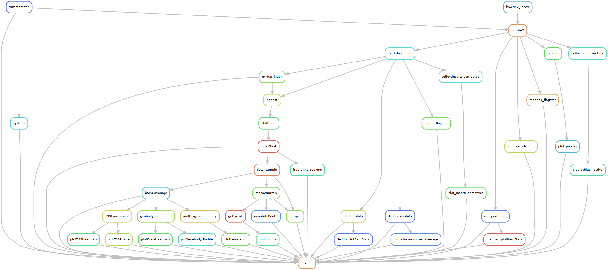

# ***Snakemake Workflow for NGS Analysis***

## **Table of Contents**

=================

* [Introduction](#introduction)
* [Usage](#usage)
  * [Configration](#configration)
  * [Sample Informations](#sample-informations)
  * [Running](#running)
* [Description](#description)
  * [Common Tools](#common-tools)
  * [ATAC-seq](#atac-seq)
  * [DNA-seq](#dna-seq)
  * [Assembly](#assembly)
  * [RNA-seq](#rna-seq)
* [Notes](#notes)

## **Introduction**

The snakemake analysis workflow for bioinformatics analysis, including

* [x] ATAC-seq/Cut&Tag/ChIP-seq
* [X] DNA-seq(WGS and WES)
* [X] Assembly
* [X] RNA-seq
* [ ] HiC

**To-Do list will be updated soon**...

## **Usage**

### *Configration*

#### Globel Config

**One-Click** global environment configuration

```sh
sh setup.sh
```

involves

* replacing the value of the root_dir parameter, which represents the project path.
* subsequently, all dependency packages are installed.
* finally, the file [base.py](scripts/base.py) from the utils folder is copied to the installed path of the `snakemake-wrapper-utils` package.

In the global configuration file, named [config.py](config/config.yaml), both the ***`pipeline`*** and ***`outdir`*** parameters require manual configuration.

* the ***`pipeline`*** parameter is used to specify the execution workflow.
* the ***`outdir`*** parameter is employed to define the path for saving the output results.

#### Workflow Config

In the global configuration file, parameters will be overridden by the identically named parameters in the workflow configuration file, indicating that the workflow configuration file takes precedence with higher priority.

workflow include:

* **[ATAC-seq](rules/ATAC/ATAC.smk)**: config file is [ATAC-seq.yaml](config/ATAC-seq.yaml)

* **[DNA-seq](rules/DNA/DNA.smk)**: config file is [DNA-seq.yaml](config/DNA-seq.yaml)
* **[Assembly](rules/Assembly/Assembly.smk)**: config file is [ATAC-seq.yaml](config/Assembly.yaml)
* **[RNA-seq](rules/RNA/RNA.smk)**: config file is [ATAC-seq.yaml](config/RNA-seq.yaml)

### *Sample Informations*

example files in directory `example`, you need to modify the path of the files `sample_info.json` and `sample_list.txt`

* *sample_list.txt*, use `generate_setting.py`

| sample | fastq1 | fastq2(optional) | type(optional) |
| ------ | ------ | ------ | -------------- |
|   sp1  | path/to/sp1.R1.fq.gz | path/to/sp1.R2.fq.gz | chip/control |
|   sp2  | path/to/sp2.R1.fq.gz | path/to/sp2.R2.fq.gz | chip/control |
|   sp3  | path/to/sp3.R1.fq.gz | path/to/sp1.R2.fq.gz | atac/test |
|   sp4  | path/to/sp4.R1.fq.gz | path/to/sp2.R2.fq.gz | atac/test |

* *sample_info.json*

```json
{
    "sp3": "sp1",
    "sp4": "sp2"
}
```

### *Running*

```sh
# run in local
snakemake -s path/to/Snakefile --use-conda -c4
# or run in the slurm task management system
snakemake -s path/to/Snakefile --profile path/to/config/slurm
```

## **Description**

### *Common Tools*

#### 1. Trimming Tools

* **[fastp](https://github.com/OpenGene/fastp)**: A tool designed to provide fast all-in-one preprocessing for FastQ files. This tool is developed in C++ with multithreading supported to afford high performance.
* **[trimmomatic](https://github.com/timflutre/trimmomatic)**: A flexible read trimming tool for Illumina NGS data.
* **[cutadapt](https://github.com/marcelm/cutadapt)**: Cutadapt finds and removes adapter sequences, primers, poly-A tails and other types of unwanted sequence from your high-throughput sequencing reads.
* **[trim_galore](https://github.com/FelixKrueger/TrimGalore)**: Trim Galore is a wrapper around [Cutadapt](https://github.com/marcelm/cutadapt) and [FastQC](http://www.bioinformatics.babraham.ac.uk/projects/fastqc/) to consistently apply adapter and quality trimming to FastQ files, with extra functionality for RRBS data.

#### 2. Mapping Tools

* **[bwa](https://github.com/lh3/bwa)**: BWA is a software package for mapping DNA sequences against a large reference genome, such as the human genome. It consists of three algorithms: BWA-backtrack, BWA-SW and BWA-MEM. The first algorithm is designed for Illumina sequence reads up to 100bp, while the rest two for longer sequences ranged from 70bp to a few megabases. BWA-MEM and BWA-SW share similar features such as the support of long reads and chimeric alignment, but BWA-MEM, which is the latest, is generally recommended as it is faster and more accurate. BWA-MEM also has better performance than BWA-backtrack for 70-100bp Illumina reads.
* **[bwa-mem2](https://github.com/bwa-mem2/bwa-mem2)**: The tool bwa-mem2 is the next version of the bwa-mem algorithm in bwa. It produces alignment identical to bwa and is ~1.3-3.1x faster depending on the use-case, dataset and the running machine.
* **[bowtie2](https://github.com/BenLangmead/bowtie2)**: Bowtie 2 is an ultrafast and memory-efficient tool for aligning sequencing reads to long reference sequences. It is particularly good at aligning reads of about 50 up to 100s or 1,000s of characters, and particularly good at aligning to relatively long (e.g. mammalian) genomes. Bowtie 2 indexes the genome with an FM Index to keep its memory footprint small: for the human genome, its memory footprint is typically around 3.2 GB. Bowtie 2 supports gapped, local, and paired-end alignment modes.
* **[hisat2](https://github.com/DaehwanKimLab/hisat2)**: HISAT2 is a fast and sensitive alignment program for mapping next-generation sequencing reads (whole-genome, transcriptome, and exome sequencing data) to a population of human genomes (as well as to a single reference genome).
* **[star](https://github.com/alexdobin/STAR)**: STAR is implemented as a standalone C++ code. STAR is free open source software distributed under GPLv3 license.
* **[minimap2](https://github.com/lh3/minimap2)**: Minimap2 is a versatile sequence alignment program that aligns DNA or mRNA sequences against a large reference database. Typical use cases include: (1) mapping PacBio or Oxford Nanopore genomic reads to the human genome; (2) finding overlaps between long reads with error rate up to ~15%; (3) splice-aware alignment of PacBio Iso-Seq or Nanopore cDNA or Direct RNA reads against a reference genome; (4) aligning Illumina single- or paired-end reads; (5) assembly-to-assembly alignment; (6) full-genome alignment between two closely related species with divergence below ~15%.

#### 3. Dedup Tools

* **[Picard](https://github.com/broadinstitute/picard)** `markduplicates`: Picard is implemented using the [HTSJDK](https://github.com/samtools/htsjdk) Java library HTSJDK to support accessing file formats that are commonly used for high-throughput sequencing data such as [SAM](https://samtools.github.io/hts-specs/) and [VCF](https://samtools.github.io/hts-specs/).
* **[sambamba](https://github.com/biod/sambamba)**: Sambamba is a high performance, highly parallel, robust and fast tool (and library), written in the D programming language, for working with SAM and BAM files.

#### 4. Others

* **[samtools](https://github.com/samtools/samtools)**: mpileup and other tools for handling SAM, BAM, CRAM.
* **[bedtools](https://github.com/arq5x/bedtools2)**: The swiss army knife for genome arithmetic.

### *ATAC-seq*

#### 1. Visualization

* **[deeptools](https://github.com/deeptools/deepTools)**: deepTools addresses the challenge of handling the large amounts of data that are now routinely generated from DNA sequencing centers. deepTools contains useful modules to process the mapped reads data for multiple quality checks, creating normalized coverage files in standard bedGraph and bigWig file formats, that allow comparison between different files (for example, treatment and control). Finally, using such normalized and standardized files, deepTools can create many publication-ready visualizations to identify enrichments and for functional annotations of the genome.

#### 2. Peak Calling

* **[macs2](https://github.com/macs3-project/MACS)**:  Model-based Analysis of ChIP-Seq (MACS), for identifying transcript factor binding sites.

#### 3. Motif Discovery

* **[homer](https://github.com/javrodriguez/HOMER)**: HOMER (Hypergeometric Optimization of Motif EnRichment) is a suite of tools for Motif Discovery and ChIP-Seq analysis.

#### 4. QC(Quality Control)

Referring to the QC methods used in the [ENCODE ATAC-seq pipeline](https://github.com/ENCODE-DCC/atac-seq-pipeline)

##### Mapping quality

* Total reads
* Mapped reads

##### Enrichment

* **Fraction of reads in peaks (FRiP)**: Fraction of all mapped reads that fall into the called peak regions, i.e. usable reads in significantly enriched peaks divided by all usable reads. In general, FRiP scores correlate positively with the number of regions. (Landt et al, Genome Research Sept. 2012, 22(9): 1813–1831)

* **Fraction of reads in annotated regions**
* **Reads count distribution of chromatin**

##### Library Complexity

* **ChIP-seq Standards**

| PBC1             | PBC2          | Bottlenecking level | NRF             | Complexity |
| :--------------: | :-----------: | :-----------------: | :-------------: | ---------- |
| < 0.5            | < 1           | Severe              | < 0.5           | Concerning |
| 0.5 ≤ PBC1 < 0.8 | 1 ≤ PBC2 < 3  | Moderate            | 0.5 ≤ NRF < 0.8 | Acceptable |
| 0.8 ≤ PBC1 < 0.9 | 3 ≤ PBC2 < 10 | Mild                | 0.8 ≤ NRF < 0.9 | Compliant  |
| ≥ 0.9            | ≥ 10          | None                | > 0.9           | Ideal      |

* **ATAC-seq Standards**

| PBC1             | PBC2          | Bottlenecking level | NRF             | Complexity |
| :--------------: | :-----------: | :-----------------: | :-------------: | ---------- |
| < 0.7            | < 1           | Severe              | < 0.7           | Concerning |
| 0.7 ≤ PBC1 ≤ 0.9 | 1 ≤ PBC2 ≤ 3  | Moderate            | 0.7 ≤ NRF ≤ 0.9 | Acceptable |
| ≥ 0.9            | > 3           | None                | > 0.9           | Ideal      |

* **PCR Bottlenecking Coefficient 1 (PBC1)**

$$PBC1=M1/MDISTINCT$$

> *M1*: number of genomic locations where exactly one read maps uniquely
> *MDISTINCT*: number of distinct genomic locations to which some read maps uniquely

* **PCR Bottlenecking Coefficient 2 (PBC2)**

$$PBC2=M1/M2$$

> *M1*: number of genomic locations where only one read maps uniquely
> *M2*: number of genomic locations where two reads map uniquely

* **Non-Redundant Fraction (NRF)** – Number of distinct uniquely mapping reads (i.e. after removing duplicates) / Total number of reads.

### *DNA-seq*

#### 1. SNV/INDEL

* **[GATK](https://github.com/broadinstitute/gatk)**: GATK4 aims to bring together well-established tools from the [GATK](http://www.broadinstitute.org/gatk) and [Picard](http://broadinstitute.github.io/picard/) codebases under a streamlined framework, and to enable selected tools to be run in a massively parallel way on local clusters or in the cloud using Apache Spark. It also contains many newly developed tools not present in earlier releases of the toolkit.

#### 2. Variant Annotation

* **[vep](https://github.com/Ensembl/ensembl-vep)**: VEP (Variant Effect Predictor) predicts the functional effects of genomic variants.

#### 3. Structure Variants

* **[delly](https://github.com/dellytools/delly)**: Delly is an integrated structural variant (SV) prediction method that can discover, genotype and visualize deletions, tandem duplications, inversions and translocations at single-nucleotide resolution in short-read and long-read massively parallel sequencing data. It uses paired-ends, split-reads and read-depth to sensitively and accurately delineate genomic rearrangements throughout the genome.

### *Assembly*

#### 1. Remove Adapter

* **[hifiadapterfit](https://github.com/sheinasim/HiFiAdapterFilt)**: Convert .bam to .fastq and remove reads with remnant PacBio adapter sequences.

#### 2. QC

* **[jellyfish](https://github.com/gmarcais/Jellyfish)**: Jellyfish is a tool for fast, memory-efficient counting of k-mers in DNA. A k-mer is a substring of length k, and counting the occurrences of all such substrings is a central step in many analyses of DNA sequence. Jellyfish can count k-mers using an order of magnitude less memory and an order of magnitude faster than other k-mer counting packages by using an efficient encoding of a hash table and by exploiting the "compare-and-swap" CPU instruction to increase parallelism.
* **[genomescope](https://github.com/schatzlab/genomescope)**: Fast genome analysis from unassembled short reads.
* **[genomescope2](https://github.com/tbenavi1/genomescope2.0)**: Reference-free profiling of polyploid genomes.
* **[gfatools](https://github.com/lh3/gfatools)**: gfatools is a set of tools for manipulating sequence graphs in the GFA or the rGFA format. It has implemented parsing, subgraph and conversion to FASTA/BED. More functionality may be added in future.
* **[seqkit](https://github.com/shenwei356/seqkit)**: A cross-platform and ultrafast toolkit for FASTA/Q file manipulation.
* **[quast](https://github.com/ablab/quast)**: Genome assembly evaluation tool.
* **[merqury](https://github.com/marbl/merqury)**: Evaluate genome assemblies with k-mers and more.
* **[meryl](https://github.com/marbl/meryl)**: A genomic k-mer counter (and sequence utility) with nice features.
* **[busco](https://gitlab.com/ezlab/busco)**: Assessing genomic data quality and beyond.

#### 3. Assemble Methods

* **[hifiasm](https://github.com/chhylp123/hifiasm)**: Hifiasm is a fast haplotype-resolved de novo assembler initially designed for PacBio HiFi reads. Its latest release could support the telomere-to-telomere assembly by utilizing ultralong Oxford Nanopore reads. Hifiasm produces arguably the best single-sample telomere-to-telomere assemblies combing HiFi, ultralong and Hi-C reads, and it is one of the best haplotype-resolved assemblers for the trio-binning assembly given parental short reads. For a human genome, hifiasm can produce the telomere-to-telomere assembly in one day.

#### 4. HiC Assembly

* **[juicer](https://github.com/aidenlab/juicer)**: Juicer is a platform for analyzing kilobase resolution Hi-C data. In this distribution, we include the pipeline for generating Hi-C maps from fastq raw data files and command line tools for feature annotation on the Hi-C maps.
* **[3d-dna](https://github.com/aidenlab/3d-dna)**: 3D de novo assembly (3D DNA) pipeline(The /tmp directory requires a large space. If not, you need to specify `--tempdir` where parallel is used in the code).

#### 5. Others

* ...

### *RNA-seq*

#### 1. Quantify

* **[rsem](https://github.com/deweylab/RSEM)**: Accurate quantification of gene and isoform expression from RNA-Seq data
* **[salmon](https://github.com/COMBINE-lab/salmon)**: Highly-accurate & wicked fast transcript-level quantification from RNA-seq reads using selective alignment
* **[kallisto](https://github.com/pachterlab/kallisto)**: Near-optimal RNA-Seq quantification
* **[Subread](https://github.com/ShiLab-Bioinformatics/subread)** `featurecounts`: The Subread software package is a tool kit for processing next-gen sequencing data. It includes Subread aligner, Subjunc exon-exon junction detector and featureCounts read summarization program.

#### 2. Counts Normalization [options]

**FPKM**: The fragments per kilobase of transcript per million mapped reads (FPKM) calculation aims to control for transcript length and overall sequencing quantity.

$$ FPKM_i  = \frac{q_i}{l_i * \sum_{j}q_j} * 10^9$$

> where $q_i$ are raw read or fragment counts, $l_i$ is feature (i.e., gene or transcript) length, and $\sum_{j}q_j$ corresponds to the total number of mapped reads or fragments.

**TPM**: The transcripts per million calculation is similar to FPKM, but the difference is that all transcripts are normalized for length first. Then, instead of using the total overall read count as a normalization for size, the sum of the length-normalized transcript values are used as an indicator of size.

$$ TPM_i = \frac{\frac{q_i}{l_i}}{\sum_j(\frac{q_j}{l_j})} * 10^6 = (\frac{FPKM_i}{\sum_jFPKM_j}) * 10^6 $$

> where $q_i$ denotes reads mapped to transcript, $l_i$ is the transcript length, and $\sum_j(\frac{q_j}{l_j})$ corresponds to the sum of mapped reads to transcript normalized by transcript length.

#### 3. Differential Expression Analysis

* **[DESeq2](https://github.com/thelovelab/DESeq2)**: Differential gene expression analysis based on the negative binomial distribution.
* **[edgeR](https://bioconductor.org/packages/release/bioc/html/edgeR.html)**: Empirical Analysis of Digital Gene Expression Data in R.
* **[limma](https://bioconductor.org/packages/release/bioc/html/limma.html)**: Linear Models for Microarray Data.

#### 4. Enrichment Analysis

## **Notes**

1. Running in conda environment, all of the packages and software no need to install mannually.
2. Please set software parameters in the configuration file.
